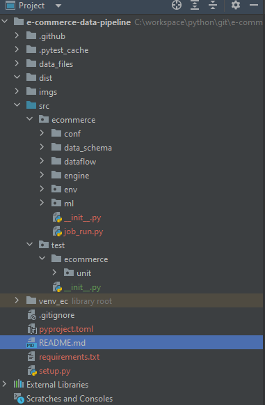
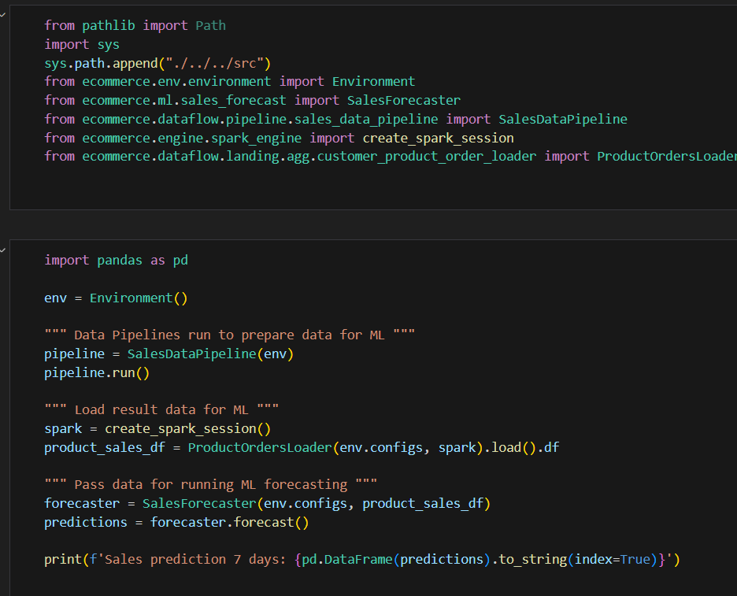
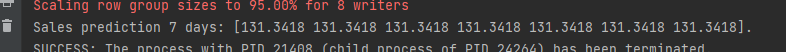

# e-commerce-data-pipeline
Transformed data for Data Scientists to do sales forecasting based on Brazilian E-Commerce Public Dataset. 

- Used yaml config file to config raw data type and path.
- Used Pandas + Spark to clean and transform data, data pipeline will read raw data, clean data and process data, then use Spark to write it as parquet file partitioned by product_id as a single table.
- Read data from parquet output file as a single table for ML modeling, use XGBoost to do simple forcasting (For test purpose only.).
- Used pytest fixture for unit test and functional test.
- The git action has configured to be triggered when any pull request is approved.
- Well-structured project as an independent application, we can use setup.py to build it as whl file for cross team usage.

# Project structure

# Usage for calling data pipeline

# Thoughts
1. Which features would you extract and how from the tables? How would you use the remaining tables?
   - "order_purchase_timestamp", "product_id", "seller_id", "customer_city", "payment_value", "review_score"
   - For remaining features, we can merge them into training dataset if needed. Or we can treat them as reference data and load into Data Lake.
2. How would you turn it into an application in production?
   - By running setup.py, we can build this application as whl package for cross team use.
   - Can build a URL entrypoint, to trigger pipelines by HTTP request call.
   - Can deploy this whl package on Databricks or Glue by scheduling it as a standard data pipeline.
3. How would you design an application if you knew that you would have to build a similar solution for a couple other countries, and the data schema might be different for them, however, you can get the same underlying data?
   - There might be slight difference for multiple country's data needs, firstly, we can use different yaml files to config params for each country separately.
   

# Sales forcast result

